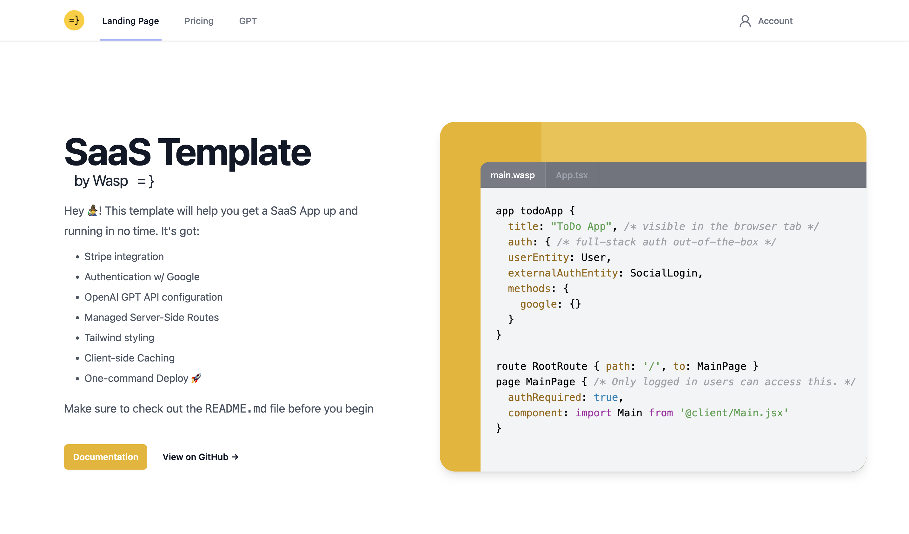

# SaaS Template w/ GPT API, Google Auth, Tailwind, & Stripe Payments

 

   

## What is it?
Entirely free SaaS template built with Prisma/Postgres, Express, React, Node (PERN stack). Use it as a springboard to build great products! 

It has pre-configured: 
- 🔐 Authentication (email + social) 
- 📩 Emailing 
- 🤑 Payments (Stripe) 
- 🤖 GPT API, 

and leverages: 
- ⌨️ TypeScript 
- 🎨 Tailwind CSS

Test it out here: [https://saas-template-gpt-client.fly.dev/](https://saas-template-gpt-client.fly.dev/)

## Running it locally

1. Make sure you have the latest version of [Wasp](https://wasp-lang.dev) installed by running `curl -sSL https://get.wasp-lang.dev/installer.sh | sh` in your terminal.
2. Run `wasp new <project-name> -t saas` to create a new app using this template. 
3. Rename the `env.server.example` file to `.env.server` and fill in your API keys
4. Make sure you have a Database connected and running. Here are two quick options:  
  - run `wasp start db` if you have Docker installed and running (if not, on MacOS run `brew install docker-machine docker` then find and run the app from your launchpad). This will start a Postgres database for you. No need to do anything else! 🤯 
  - or provision a Postgres database on [Railway](https://railway.app), go to settings and copy the `connection url`. Paste it as `DATABASE_URL=<your-postgres-connection-url>` into your `env.server` file.  
5. Run `wasp db migrate-dev`
6. Run `wasp start`. This will install all dependencies and start the client and server for you :)
7. Go to `localhost:3000` in your browser (your NodeJS server will be running on port `3001`)
8. Install the Wasp extension for VSCode to get the best DX
9. Check the files for comments containing specific instructions
10. Enjoy and Have fun. When you create an App with this template, be kind and let me know by tagging me on twitter [@hot_town](https://twitter.com/hot_town)

## Deploying it quickly to Fly.io

1. Create an account on Fly.io
2. Install the Fly CLI by running `curl -L https://fly.io/install.sh | sh` on Linux/MacOS
3. Run `wasp deploy fly setup my-wasp-app mia`
4. Run `wasp deploy fly cmd secrets set ENV_VAR_EXAMPLE=<your-env-var> --context=server`, making sure to fill in all of your env vars
5. Run `wasp deploy fly create-db mia`
6. Run `wasp deploy fly deploy`
7. make sure you've updated your Stripe webhook URL in your [Stripe dashboard](https://dashboard.stripe.com/) to point to your Fly app's URL 
8. Also make sure you've updated your [Google Auth callback URL](https://wasp-lang.dev/docs/integrations/google#google-auth) to point to your Fly app's URL 

You can also see the guides for deploying manually to Fly, Railway, and Netlify [here](https://wasp-lang.dev/docs/deploying).

## How it works

- 🐝 [Wasp](https://wasp-lang.dev) - allows you to build full-stack apps with 10x less boilerplate
- 🎨 [Tailwind CSS](https://tailwindcss.com/) - CSS that's easy to work with
- 🤖 [OpenAI](https://openai.com/) - GPT-3.5 turbo API
- 💸 [Stripe](https://stripe.com/) - for payments
- 📧 [SendGrid](https://sendgrid.com/) - for email

[Wasp](https://wasp-lang.dev) as the full-stack framework allows you to describe your app’s core features in the `main.wasp` config file in the root directory. Then it builds and glues these features into a React-Express-Prisma app for you so that you can focus on writing the client and server-side logic instead of configuring. For example, I did not have to use any third-party libraries for Google Authentication. I just wrote a couple lines of code in the config file stating that I want to use Google Auth, and Wasp configures it for me. Check out the comments `main.wasp` file for more.

[Stripe](https://stripe.com/) makes the payment functionality super easy. I just used their `Subscription` feature. After the user pays, their `hasPaid` and `datePaid` fields are updated in the database via the webhook found in the `src/server/webhooks.ts` file. 

[Wasp's integrated Jobs](https://wasp-lang.dev/docs/language/features#jobs) feature is used to run a cron job every week to send an newsletter email. I used [SendGrid](https://sendgrid.com/) for the email service.

If you have any other questions, feel free to reach out to me on [twitter](https://twitter.com/hot_town) or in the [Wasp discord server](https://discord.gg/rzdnErX).
